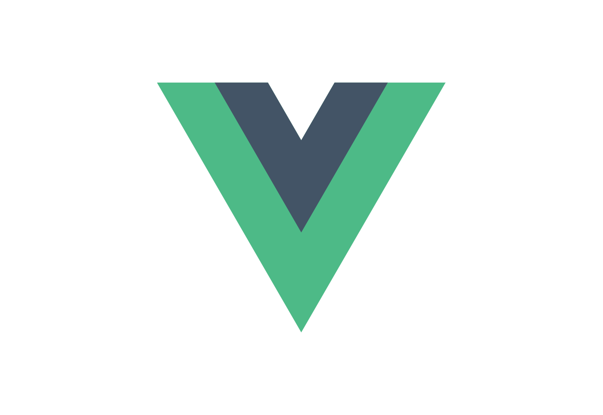

# JAMstack / Flat sites

## Jigsaw

[**Jigsaw**](https://jigsaw.tighten.co/docs/installation/) is a framework for rapidly building static sites using Laravel, the
same modern tooling that powers our web applications.

## Javascript Framework

|  Vue.js                                                                                                |  React                                                                                                              |
| ------------------------------------------------------------------------------------------------------------------------------- | --------------------------------------------------------------------------------------------------------------------------------------------- |
| [**Gridsome**](https://gridsome.org/docs) - Fast by default, SEO-friendly Static PWA, GraphQL                                   | [**Gatsby**](https://www.gatsbyjs.org/tutorial/part-zero/#install-gatsby-cli) - Fast by default, SEO-friendly Static PWA, GraphQL             |
| [**Nuxt**](https://nuxtjs.org/guide/installation) - Vue based routing system, Good for people experienced with Vue, Lightweight | [**Next**](https://nextjs.org/learn/basics/getting-started) - React based routing system, Good for people experienced with React, Lightweight |

:::tip Notes

- Gatsby and Gridsome essentially do the same thing, just depends on whether you’d prefer to use Vue or React. The same is true when comparing Next / Nuxt.
- If the framework has a CLI use that instead of a repo. Jigsaw has an init command but nothing setup by default for our tailwind/postcss config.
- Most CLI tools have an option for using Tailwind.

:::
