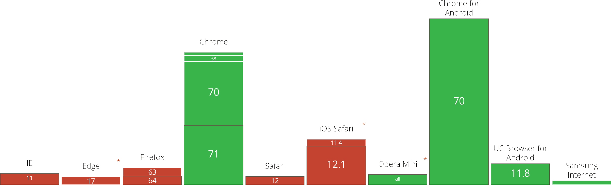
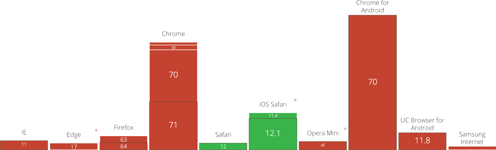
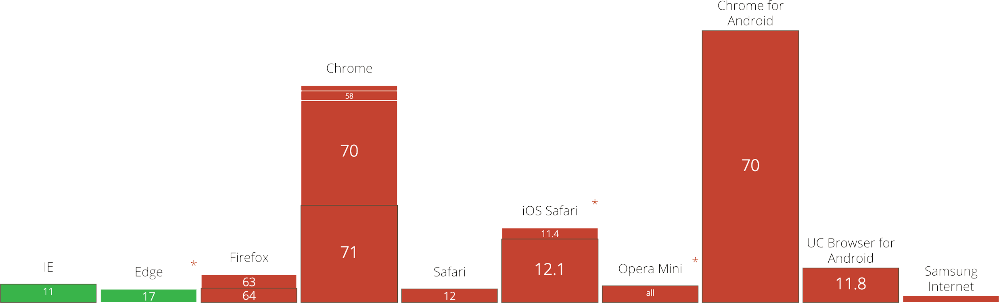

# Next Gen Image Formats

Next-gen image formats, such as WebP, JPEG 2000 and JPEG XR have superior compression and quality when compared to regular JPEGs and PNGs. The benefits of using these formats is that they will load faster, and be smaller in size.

## WebP

WebP lossless images are 26% smaller in size compared to PNGs, and up to 34% smaller than comparable JPEG images. WebP also supports transparency.

### WebP Support

WebP is natively supported in Google Chrome and the Opera browser, however, Edge and Firefox both have announced that they are adding/have already added WebP support in their future releases. This makes WebP the most beneficial image format to implement.

[](https://caniuse.com/#feat=webp)

### WebP Generation

There are plenty of generators online to create WebP images in the browser. Additionally, there is now lots of software that will let you export images in WebP format - there's even a [WebP Photoshop plugin](http://telegraphics.com.au/sw/product/WebPFormat#webpformat)! The easiest way to get WebP images, however, is to integrate WebP generation into your task runner.

#### Gulp

If you're using Gulp, there's a great plugin called [`gulp-webp`](https://www.npmjs.com/package/gulp-webp), which takes PNG and JPEG images and creates a WebP version.

Install it with either yarn or npm.

```shell
npm i gulp-webp
```

```shell
yarn add gulp-webp
```

Then, if you're not using [`gulp-load-plugins`](https://www.npmjs.com/package/gulp-load-plugins), require it into your `gulpfile.js`

```js
const webp = require('gulp-webp')
```

You can then simply pipe the webp function to the end of your pre-existing image procesing task.

```js
gulp.task('images', () =>
  gulp
    .src(paths.images.src)
    // Regular task goes here
    .pipe(webp())
    .pipe(gulp.dest(paths.images.dest))
)
```

:::tip
If you want to put your webp images in a seperate folder, you can just pass a different parameter into the `gulp.dest` function.
:::

#### Webpack

If you're using Webpack, chances are you already have [`image-webpack-loader`](https://github.com/tcoopman/image-webpack-loader) installed. If not, you can do so using yarn or npm.

```shell
npm i image-webpack-loader
```

```shell
yarn add image-webpack-loader
```

This has WebP support out of the box, you simply just add the webp option to your configuration and you're good to go.

```js
rules: [
  {
    test: /\.(gif|png|jpe?g)$/i,
    use: [
      'file-loader',
      {
        loader: 'image-webpack-loader',
        options: {
          webp: {
            quality: 75
          }
        }
      }
    ]
  }
]
```

## JPEG 2000

JPEG 2000 is an image coding system that uses state-of-the-art compression techniques based on wavelet technology and offers an extremely high level of scalability and accessibility. Content can be coded once at any quality, up to lossless, but accessed and decoded at a potentially very large number of other qualities and resolutions and/or by region of interest, with no significant penalty in coding efficiency.

### JPEG 2000 Support

JPEG 2000 is natively supported in Safari and Safari on iOS. Apple has not announced any support for WebP, however, they have supported WebP as a beta feature since 2016. No other browsers have announced they will be supporting JPEG 2000. JPEG 2000 support is only recommended if your project could significantly benefit from the extra compression on Apple devices, or if the projects primary target audience is Apple product users.

[](https://caniuse.com/#feat=jpeg2000)

### JPEG 2000 Generation

The majority of apps running on an Apple system will support saving images as JPEG 2000. When it comes to online tools and task-runners, support is rather limited.

#### Gulp

If you're using gulp, you can use the plugin [`gulp-jpeg-2000`](https://www.npmjs.com/package/gulp-jpeg-2000) to convert images to JPEG 2000. The only issue with this plugin is it also requires [ImageMagick](http://www.imagemagick.org/) to be installed on the system.

ImageMagick can be installed on Mac using [Homebrew](https://brew.sh/).

```shell
brew install imagemagick
```

:::warning
If you are deploying your project to a server, you will need to consider that your server will also need ImageMagick installed to work.
:::

Next, install `gulp-jpeg-2000` with either yarn or npm.

```shell
npm i gulp-jpeg-2000
```

```shell
yarn add gulp-jpeg-2000
```

Like with `gulp-webp`, if you're not using [`gulp-load-plugins`](https://www.npmjs.com/package/gulp-load-plugins), require it into your `gulpfile.js`.

```js
const jp2 = require('gulp-jpeg-2000')
```

Yet again, you can then simply pipe the jp2 function to the end of your pre-existing image procesing task.

```js
gulp.task('images', () =>
  gulp
    .src(paths.images.src)
    // Regular task goes here
    .pipe(jp2())
    .pipe(gulp.dest(paths.images.dest))
)
```

#### Webpack

Currently, there is no known way to generate JPEG 2000 images with webpack.

## JPEG XR

The JPEG XR specification enables greater effective use of compressed imagery with this broadened diversity of application requirements. JPEG XR supports a wide range of color encoding formats including monochrome, RGB, CMYK and n-component encodings using a variety of unsigned integer, fixed point, and floating point decoded numerical representations with a variety of bit depths. The primary goal is to provide a compressed format specification appropriate for a wide range of applications while keeping the implementation requirements for encoders and decoders simple. A special focus of the design is support for emerging high dynamic range (HDR) imagery applications.

### JPEG XR Support

JPEG XR is natively supported in Internet Explorer / Edge. While Edge has announced they will be supporting WebP in future versions, no other browsers have announced they will be supporting JPEG XR. With the support being exclusive to Internet Explorer / Edge, and Edge announcing support for WebP, using JPEG XR images is not recommended.

[](https://caniuse.com/#feat=jpegxr)

### JPEG XR Generation

There are tools online for converting [JPEG](https://www.aconvert.com/image/jpg-to-jxr/) and [PNG](https://www.aconvert.com/image/png-to-jxr/) files to JPEG XR. At this time there are no plugins for gulp or webpack to generate JPEG XR images.

## Implementation

### Images

Using next-gen image formats in regular images is simple. Simply adopt the `<picture>` element, placing your different formats in `<source>` tags inside.

```html
<picture>
  <source srcset="example.webp" type="image/webp" />
  <source srcset="example.jp2" type="image/jp2" />
  <source srcset="example.jxr" type="image/vnd.ms-photo" />
  <source srcset="example.jpg" type="image/jpeg" />
  
</picture>
```

:::warning
Be sure to put your next-gen image formats first, followed by your fallback formats, and finally an image tag. Browsers will go from top to bottom, and load the **first** image type it supports.
:::

### Background Images

Using background images is a little trickier, due to the way CSS works, **all** the image versions will be downloaded, regardless of whether or not they're even supported. The best way to get around this is to use feature detection.

If you're just supporting WebP, you can add the following script to your project.

```js
let img = new window.Image()

img.src =
  'data:image/webp;base64,UklGRi4AAABXRUJQVlA4TCEAAAAvAUAAEB8wAiMwAgSSNtse/cXjxyCCmrYNWPwmHRH9jwMA'

img.onload = img.onerror = () => {
  if (img.height === 2) document.documentElement.classList.add('webp')
  else document.documentElement.classList.add('no-webp')
}
```

If you want to support all next-gen image formats, then it is recommended you use [Modernizer](https://modernizr.com/download?jpeg2000-jpegxr-webp-webpalpha-setclasses).

Both of these methods will do the same thing, add classes to the page which determine feature support for each image format.

You can then just write the following CSS.

```css
.no-webp .example-element {
  background-image: url('example.jpg');
}

.webp .example-element {
  background-image: url('example.webp');
}
```

Or if you're using Modernizer to detect all formats.

```css
.no-webp.no-jpeg-2000.no-jpeg-xr .example-element {
  background-image: url('example.jpg');
}

.webp .example-element {
  background-image: url('example.webp');
}

.jpeg-2000.no-webp .example-element {
  background-image: url('example.jp2');
}

.jpeg-xr.no-webp .example-element {
  background-image: url('example.jxr');
}
```

:::warning
This method relies on JavaScipt being enabled to function, users without JavaScript will never get any background images loaded. CSS Tricks have [a great solution](https://css-tricks.com/using-webp-images/#article-header-id-5) to this issue.
:::
